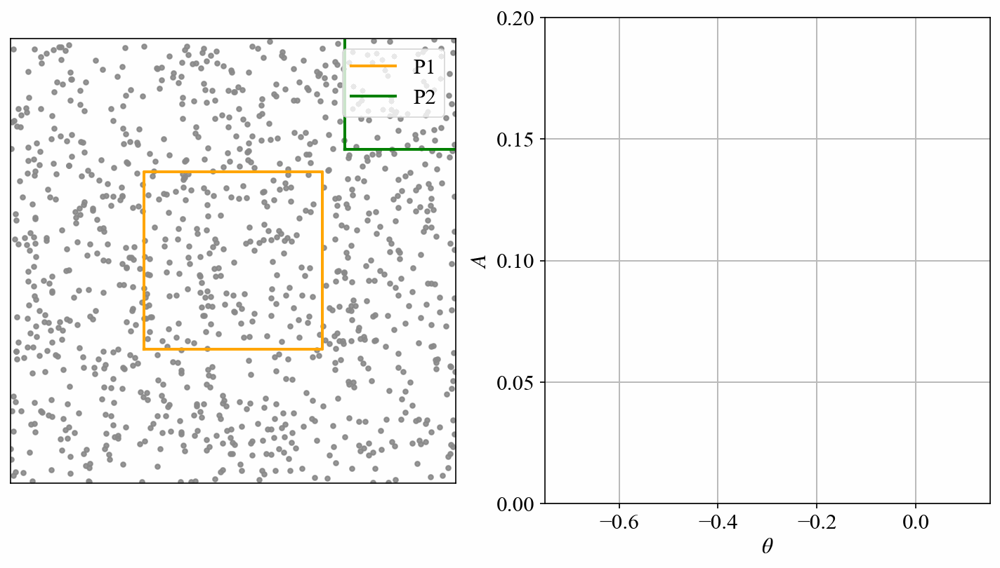
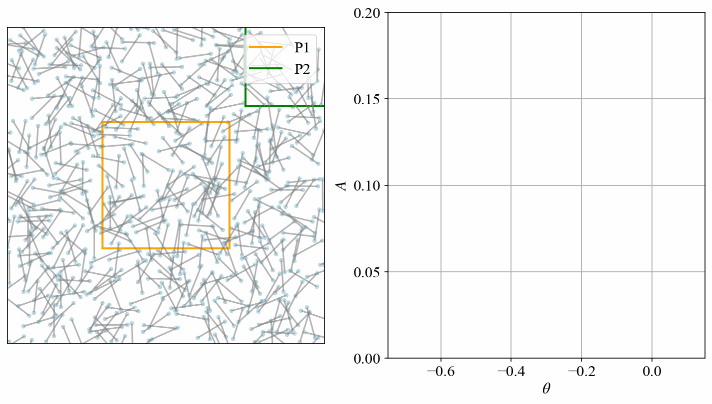
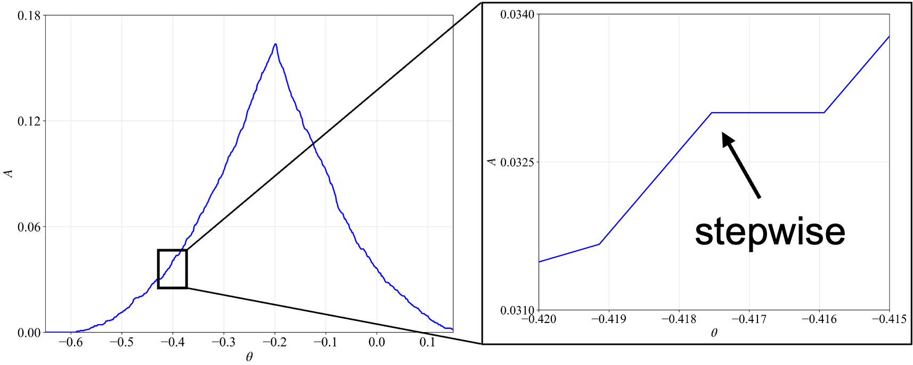
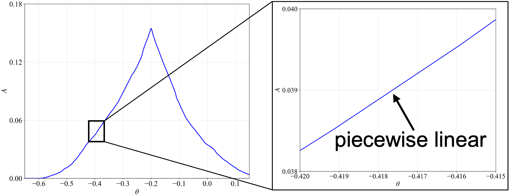
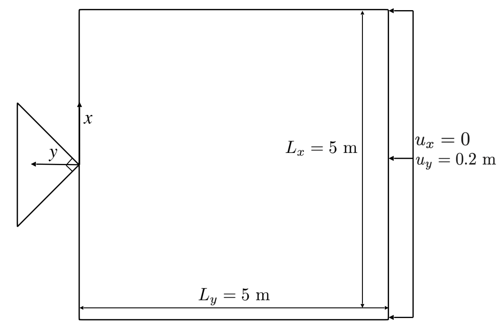
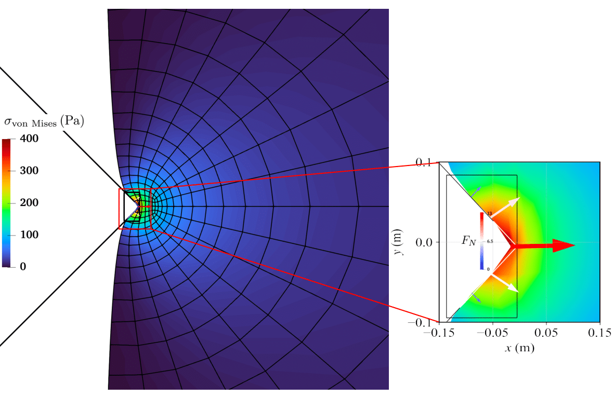
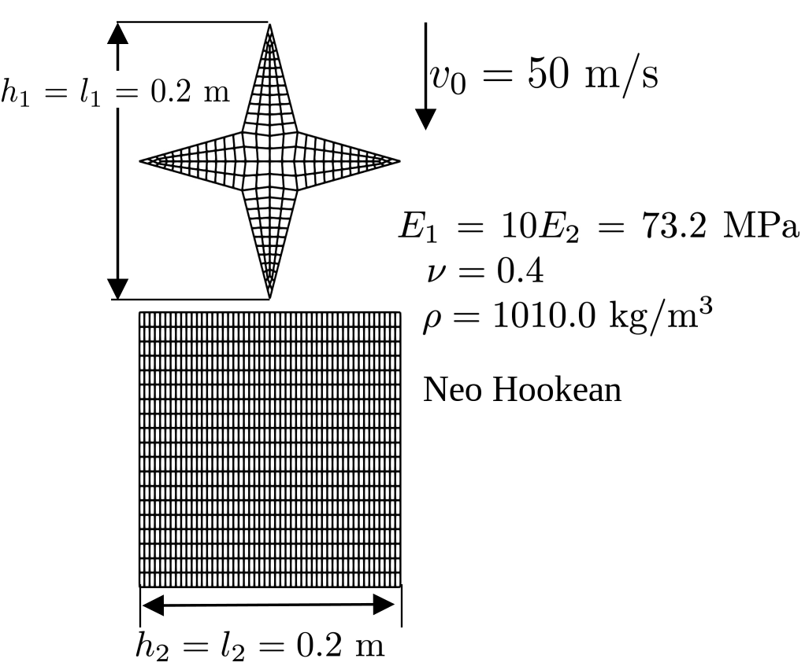

# FMC-contact

<!--    -->

<!-- <p align="middle">
  
</p> -->

A finite element framework for solving contact problems using the [Fiber Monte Carlo (FMC)](https://openreview.net/forum?id=sP1tCl2QBk), enabling differentiable estimation of [volume-based contact energy](https://www.sciencedirect.com/science/article/abs/pii/S0045782520306782) for contact forces. 

Backend support: 1. modern automatic differentiation and finite element libraries, including [JAX](https://github.com/google/jax) and [JAX-FEM](https://github.com/feihuanch/jax-fem). 2. repository of [FMC](https://github.com/PrincetonLIPS/fibermc).
 
## Overview
Contact forces are derived as the gradient of a a volume-based energy function. FMC enables this approach by providing differentiable volume estimation, in contrast to the non-differentiable estimation by standard MC.

<p align="middle">
  <table>
    <tr>
      <td align="center" style="padding: 10px;">
        
        <br>
        <em style="font-size: 12px; line-height: 1.2;">Standard Monte Carlo: Point sampling</em>
      </td>
      <td align="center" style="padding: 10px;">
        
        <br>
        <em style="font-size: 12px; line-height: 1.2;">Fiber Monte Carlo: Line segment sampling</em>
      </td>
    </tr>
  </table>
</p>

<p align="middle">
  <table>
    <tr>
      <td align="center" style="padding: 10px;">
        
        <br>
        <em style="font-size: 12px; line-height: 1.4;">Standard Monte Carlo: non-differentiable estimates</em>
      </td>
      <td align="center" style="padding: 10px;">
        
        <br>
        <em style="font-size: 12px; line-height: 1.4;">Fiber Monte Carlo: differentiable estimates</em>
      </td>
    </tr>
  </table>
</p>

## Features

:fish: **Complex geometry handling**: Derive contact forces from energy gradients, avoiding projection issues at corners and edges.  

:star: **Non-matching mesh support**: Remove contact pair search, master–slave setup, and projection iterations for non-matching meshes.

:snowflake: **Easy solver integration**: Incorporate contact forces directly into discretized weak forms like an ``add-on''

## Installation

First install `JAX` (see [JAX installation guide](https://docs.jax.dev/en/latest/installation.html)), then follow the [JAX-FEM instructions](https://github.com/deepmodeling/jax-fem?tab=readme-ov-file#installation) to install `JAX-FEM`, which will create a new conda environment. Activate the environment and clone the repository:

```bash
git clone https://github.com/CMSL-HKUST/FMC_contact.git
cd FMC_contact
```

then install the package locally:

```bash
pip install -e .
```

## Examples

### Small-strain: Indentation by a wedge

<p align="middle">
  
</p>
<p align="middle">
    <em >The model setup: geometry and boundary conditions.</em>
</p>

Change to the cloned directory and run
```bash
python -m examples.static.main
```
<p align="middle">
  
</p>
<p align="middle">
    <em >Distribution of von mises stress  , represented by colormap.</em>
</p>


### Finite-strain: Collision of two elastic bodies

<p align="middle">
  
</p>
<p align="middle">
    <em >The model setup: geometry and boundary conditions.</em>
</p>

Change to the cloned directory and run
```bash
python -m examples.dynamics.main
```
<p align="middle">
  
</p>
<p align="middle">
    <em >Dynamic evolution of von mises stress during collision.</em>
</p>

### Others

:mega: Coming soon!

## License

This project is licensed under the GNU General Public License v3 - see the [LICENSE](https://www.gnu.org/licenses/) for details.

## Citations

If you found this library useful, we appreciate your support if you consider citing the following paper:

```bibtex
@article{wang2025sovling,
  title={Solving contact problems using Fiber Monte Carlo},
  author={Wang, Xinyu and Xu, Weipeng and Xue, Tianju},
  journal={arXiv preprint arXiv:2509.08609},
  year={2025},
  url={https://arxiv.org/abs/2509.08609}
}
```

```bibtex
@inproceedings{
richardson2024fiber,
title={Fiber Monte Carlo},
author={Nick Richardson and Deniz Oktay and Yaniv Ovadia and James C Bowden and Ryan P Adams},
booktitle={The Twelfth International Conference on Learning Representations},
year={2024},
url={https://openreview.net/forum?id=sP1tCl2QBk}
}
```